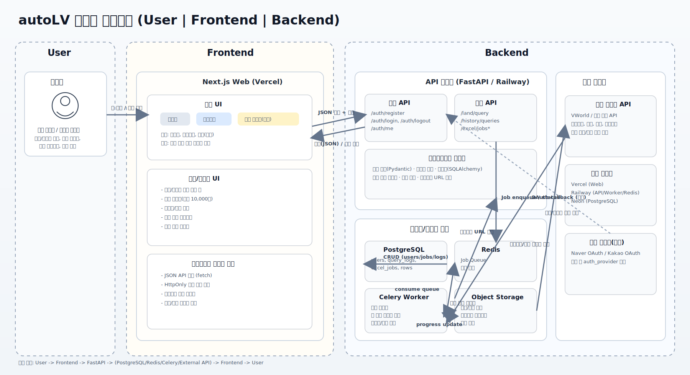

# 시스템 아키텍처 (v2.2.0)

## 1. 아키텍처 개요
- Frontend(Web): Next.js 15 (App Router), TypeScript, Tailwind
- Frontend(App): Capacitor Android Wrapper (`apps/mobile`)
- Backend: FastAPI (Railway)
- Database: PostgreSQL (Neon/Railway), 로컬 SQLite
- Spatial: PostGIS (`geog`, `geom`)
- Cache: Redis (좌표->PNU 캐시, 지도 조회 보조)
- External API:
  - VWorld (주소/좌표/공시지가/토지특성)
  - Kakao Maps JS SDK (지도 렌더링)
- Network Fallback: AWS EC2 고정 IP VWorld 프록시 (`infra/vworld-proxy`)
- Reference Data:
  - 법정동 코드: `apps/web/public/ld_codes.json`
  - 도로명 원본: `docs/TN_SPRD_RDNM.txt`

## 2. 런타임 구성
### 2.1 Web 계층
- 페이지
  - `/features` (비로그인 기본 랜딩)
  - `/search` (개별조회)
  - `/map` (지도조회, 로그인 필요)
  - `/files` (파일조회, 로그인 필요)
  - `/history` (조회기록, 로그인 필요)
  - `/mypage` (계정관리, 로그인 필요)
  - `/privacy`, `/account-deletion` (운영/스토어 정책 페이지)
- 인증 상태에 따라 상단 네비게이션 노출 범위가 달라진다.

### 2.2 API 계층
- 인증/계정: `/api/v1/auth/*`
- 개별조회: `/api/v1/land/*`
- 파일조회: `/api/v1/bulk/*`
- 조회기록: `/api/v1/history/*`
- 지도조회: `/api/v1/map/*`
- 헬스체크: `/health`

### 2.3 저장 계층
- `users`: 계정/약관/연락처/프로필
- `email_verifications`: 이메일 인증 코드 수명주기
- `bulk_jobs`: 대량조회 작업 상태/결과 경로
- `query_logs`: 개별/지도 조회기록
- `parcels`: 지도 조회 캐시 + 공간 질의 기초 데이터
- 파일 스토리지
  - 업로드/결과: `apps/api/storage/bulk`
  - 프로필 이미지: `apps/api/storage/profile_images`

## 3. 핵심 데이터 흐름
### 3.1 회원가입/로그인
1. Web -> `/auth/email-availability`로 이메일 중복 확인
2. Web -> `/auth/recovery/send-code`로 회원가입 인증코드 발송
3. Web -> `/auth/register`로 가입 완료(약관 동의 포함)
4. Web -> `/auth/login` 성공 시 HttpOnly 쿠키 발급
5. Web -> `/auth/me`로 세션 검증

### 3.2 개별조회
1. 사용자 입력(지번/도로명) -> `/land/single`
2. API가 PNU 생성/변환 후 VWorld 조회
3. 실패 시 직접 호출 -> 프록시 호출 순으로 재시도
4. 연도별 행을 정규화/정렬 후 반환
5. 로그인 사용자는 `/history/query-logs`에 저장

### 3.3 파일조회
1. `/bulk/guide`, `/bulk/template`로 업로드 준비
2. `/bulk/jobs` 업로드(비동기 작업 생성)
3. 백그라운드 처리:
   - 헤더 자동 매핑/정규화
   - 유니크 주소 키 병렬 조회
   - 5행 단위 진행률 업데이트
   - 결과 파일 생성
4. `/bulk/jobs` 폴링으로 상태/이력 확인
5. `/bulk/jobs/{id}/download`로 완료 작업 결과 다운로드

### 3.4 지도조회
1. Web에서 Kakao 지도 클릭 또는 주소 입력
2. `/map/click` 또는 `/map/search` 호출
3. API 내부 처리:
   - 좌표->PNU 역지오코딩
   - Redis PNU 캐시 활용
   - `parcels` 캐시 조회
   - 필요 시 VWorld 실시간 조회
   - 증감률/면적×단가/인근 평균(200m) 계산
4. 필요 시 `/map/price-rows`, `/map/land-details` 추가 조회
5. `/map/export` CSV 다운로드
6. 결과를 `/history/query-logs`(search_type=`map`)에 저장

### 3.5 구역조회(폴리곤)
1. 로그인 사용자가 지도조회 화면의 `구역 조회` 모드에서 폴리곤 꼭짓점을 선택
2. `/map/zones/analyze` 호출 (구역명 + 좌표 + 포함 임계치)
3. API 내부 처리:
   - 폴리곤 정규화/검증(`ST_IsValid`)
   - 면적 제한 검사(`ST_Area`)
   - VWorld 지적도 피처 조회(`/req/data`, `LP_PA_CBND_BUBUN`)
   - `parcels` 지오메트리 업서트
   - PostGIS 교차 계산(`ST_Intersection`), 90% 이상 포함 필지 판정
   - 최신연도 기준 합계/면적 기반 금액 집계
4. 결과를 `zone_analyses`, `zone_analysis_parcels`에 영속 저장
5. 프론트에서 요약 카드 + 필지 목록 + 선택 제외 + CSV 다운로드 제공

### 3.6 조회기록
1. `/history/query-logs`로 최신순 목록 조회
2. 유형/시도/시군구 필터 및 정렬(`created_at`, `address_summary`, `search_type`, `result_count`)
3. 항목 클릭 시:
   - `jibun|road` -> `/search?recordId=...`
   - `map` -> `/map?recordId=...`

## 4. 장애 복원력
- VWorld 직접 호출 실패 시 EC2 프록시 경유 재시도
- 에러 응답에 직접 호출/프록시 호출 실패 원인을 함께 반환
- `DATABASE_URL` 정규화(`postgresql://` -> `postgresql+psycopg://`)로 배포 환경 호환성 확보
- 도로명/법정동 파일 경로 자동 탐색 로직으로 monorepo/단독배포 모두 지원

## 5. 아키텍처 다이어그램

## 6. 다음 단계(TO-BE)
- 구역조회 이력 페이지(구역명 검색/재열람/비교) 추가
- 운영 지표 수집(에러율, VWorld 실패율, 프록시 사용률, 구역분석 성공률)
- 소셜 로그인(네이버/카카오)
